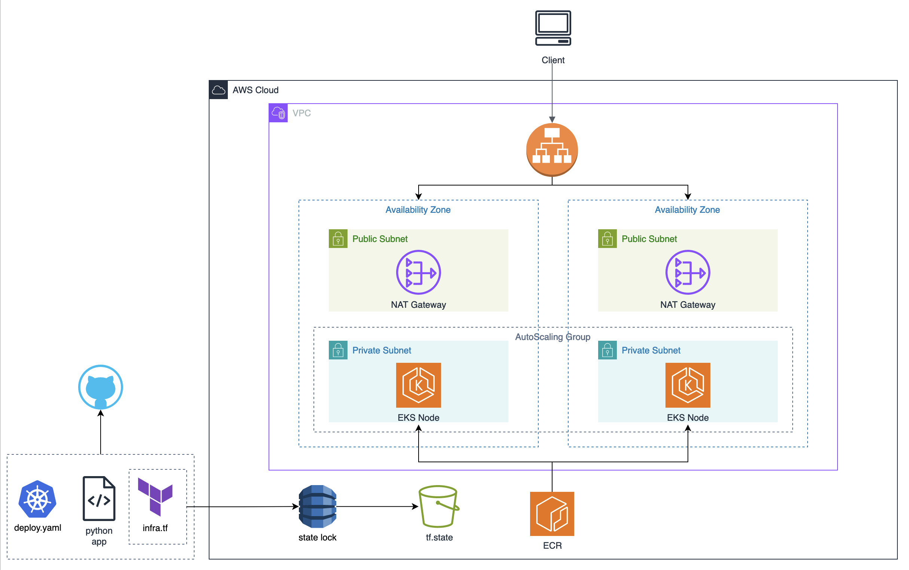

# Python Weather Application

This repository contains a web application designed to browse weather conditions. The application is built with Python and utilizes the Flask framework. It prompts the user for a city, queries the weather data via an API call to [openweathermap.org](openweathermap.org), and then returns the data. The application is deployed into an AWS EKS cluster, which hosts the web servers behind an application load balancer. The AWS infrastruture is managed with Terraform.




## Requirements

This application requires the following tools for deployment:
- [AWS Account](https://aws.amazon.com/)
- [AWS CLI](https://aws.amazon.com/cli/)
- [Git](https://git-scm.com/)
- [Docker](https://www.docker.com/products/docker-desktop/)
- [Terraform](https://developer.hashicorp.com/terraform/install?ajs_aid=2b4ed9da-8a40-472d-891c-a45f64581f86&product_intent=terraform)
- An API Key from [openweathermap.org](openweathermap.org)
- [VSCode](https://code.visualstudio.com/) or your preferred code editor


## Infrastructure Configuration and Deployment

#### 1. Download the github repository to your local device. 
```bash
$ git clone https://github.com/nimbleclick/EKS-Weather-App
```  

#### 2.  Create a secret containing your openweathermap.org API Key in AWS Secrets Manager via the AWS CLI. Replace the API_KEY_VALUE.
```bash
$ aws secretsmanager create-secret --name /python-weather-app/api-key --region us-east-1 --secret-string "{\"API_KEY\":\"API_KEY_VALUE\"}"
```
> [!TIP]
> This command will output the secret ARN. Take note of that. It will be needed in the next step to edit the secret variable.

#### 3. Modify the Terraform files before bulding the AWS infrastructure
  Open the EKS-Weather-App directory in VS Code and edit the terraform files as follows.
  
  **variables.tf:**

  *aws_account_id*
  ```bash
  # Get AWS Account ID

  $ aws sts get-caller-identity
  ```

  *aws_managed_key_id_secrets_manager*
  ```bash
  # Get KeyID

  $ aws kms describe-key --key-id alias/aws/secretsmanager
  ```

  *secret*
  > [!TIP]
  > Copy this portion from the secret ARN: python-weather-app/api-key-######

  *tf_state_bucket*
  > [!TIP]
  > Create a name for the S3 Bucket that will store your tf.state file. It must be globally unique among all existing S3 Buckets.

  *tags (optional)*
  > [!TIP]
  > Edit the GitHub_Repo tag with your ACCOUNT and REPO_NAME

  **backend.tf**
  > [!TIP]
  > Enter your S3 Bucket name in line 3 of backend.tf. Leave lines 2-7 commented out for now.

#### 4. Build the AWS infrastructure with Terraform

  In your terminal, change directory to EKS-Weather-App/terraform. Run the following commands:
  ```bash
  # Initialize terraform

  $ terraform init
  ```

  ```bash
  # View terraform deployment plan

  $ terraform plan
  ```

  > [!CAUTION] 
  > The next step will deploy the AWS infrastructure. Several of the resources will incure hourly/monthly costs.

  ```bash
  # Apply the terraform deployment

  $ terraform apply --auto-approve
  ```

#### 5. Enable Terraform state locking and S3 storage
  Uncomment lines 2-7 in backend.tf and reinitialize Terraform:
  ```bash
  # Reinitialize terraform

  $ terraform init
  ```
 Type "yes" when prompted in the terminal. The tf.state file will now be stored in an S3 Bucket and state locking via DynamoDB is enabled.

#### 6. Create the Docker Image and upload to ECR
Change directory to EKS-Weather-App/ and run the following commands. The AWS_Account_ID needs to be replaced. These commands can also be copy/pasted from the ECR repository page by clicking on the "View push commands" option in the AWS Console.

```bash
# Retrieve auth token and authenticate docker client to the registry

aws ecr get-login-password --region us-east-1 | docker login --username AWS --password-stdin AWS_ACCOUNT_ID.dkr.ecr.us-east-1.amazonaws.com

# Build the docker image

docker build -t eks-python-weather-app .

# Update the tag on the docker image

docker tag eks-python-weather-app:latest AWS_ACCOUNT_ID.dkr.ecr.us-east-1.amazonaws.com/eks-python-weather-app:latest

# Push docker image to ECR repository

docker push AWS_ACCOUNT_ID.dkr.ecr.us-east-1.amazonaws.com/eks-python-weather-app:latest
```

## Application Deployment
#### 1. Edit the Kubernetes deployment file

An AWS Account ID needs to be replaced in following lines in the *k8s-infrastructure.yaml* file before deploying the application.

- Line 11: replace AWS_ACCOUNT_ID
- Line 19: replace AWS_ACCOUNT_ID
- line 84: replace AWS_ACCOUNT_ID


#### 2. Launch a CloudShell session in the AWS Console and upload the following files to the Cloudshell terminal. The option is under Actions > Upload File.
  - startup.sh
  - /kubernetes/k8s-infrastructure
  - /kubernetes/secretproviderclasses-role.yaml

#### 3. Run the startup script to deploy the app:
```bash
# Build K8s deployment

sh startup.sh
```
#### 4. When the command completes the application is deployed to the EKS cluster on two nodes. You can visit the website via the URL of the Application Load Balancer. Run this command in CloudShell to get the ALB URL:
```bash
# Get DNS Name

kubectl describe ingress -n prod python-app-ingress | grep -i address:
```

> [!NOTE]
> The website will not load until the Application Load Balancer has finished provisioning. You can check the status in the EC2 Console.